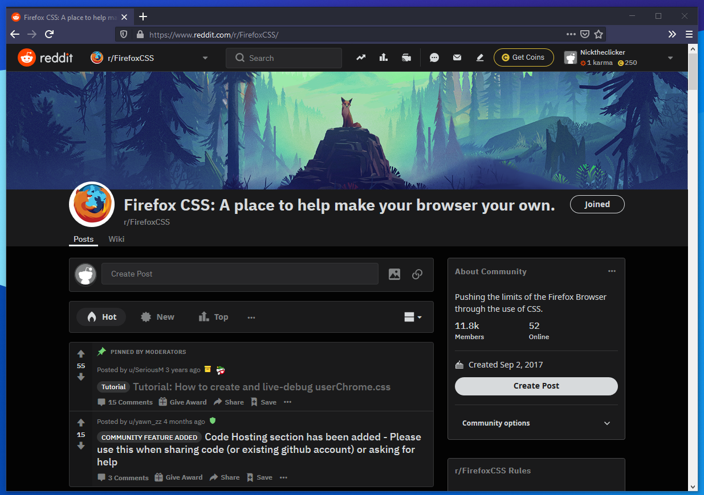

# Firefox-CSS

* Removes the space before tabs for a clean look for non maximized windows.
* Automatically hide the bookmarks bar when it's not in focus.

## How to install

1. Open `about:profiles`.
2. Open the root directory for the Firefox version you're using.
3. Create a directory called "chrome".
4. Add the userChrome.css file.
5. Open `about:config` and set the option `toolkit.legacyUserProfileCustomizations.stylesheets` to true.
6. Go back to `about:profiles` and click the restart normally button.

Theme used in screenshot: [Vampyric Dark](https://addons.mozilla.org/en-US/firefox/addon/vampyric-dark/).
